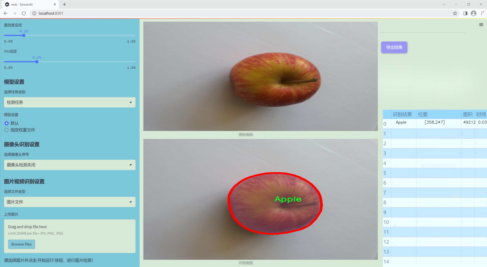
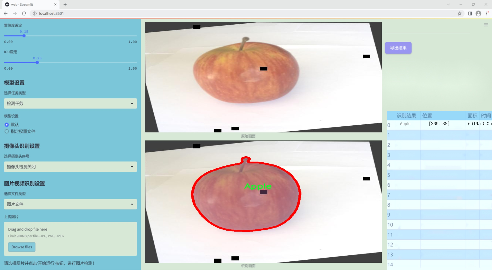
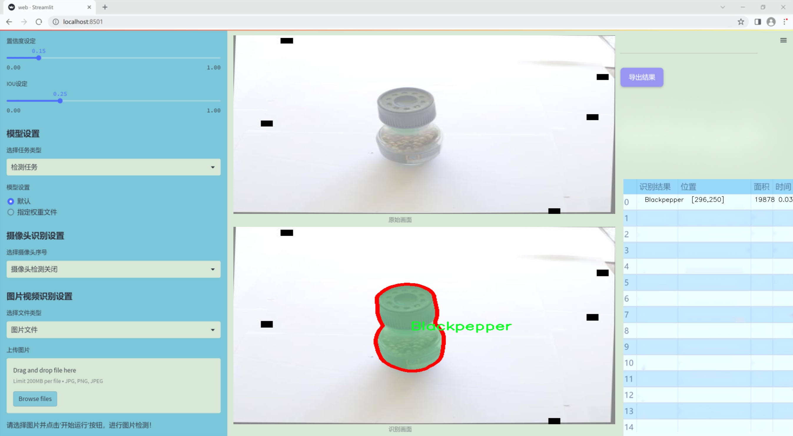
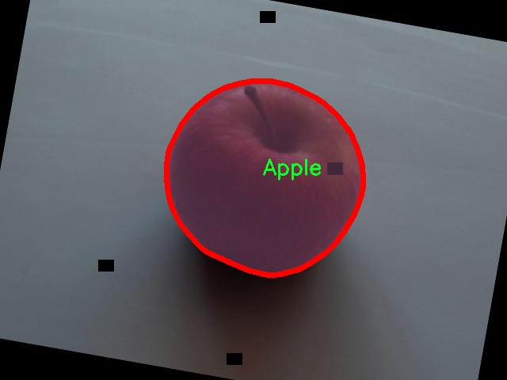
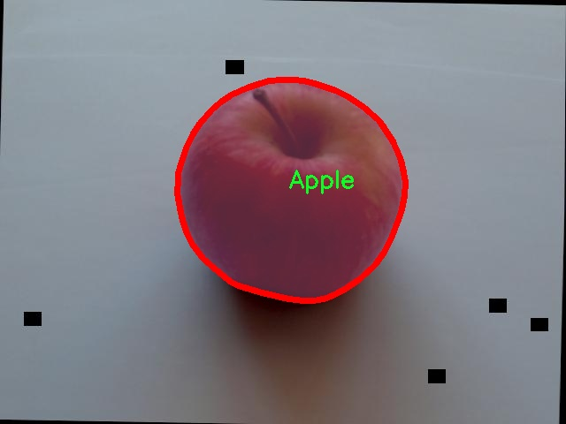
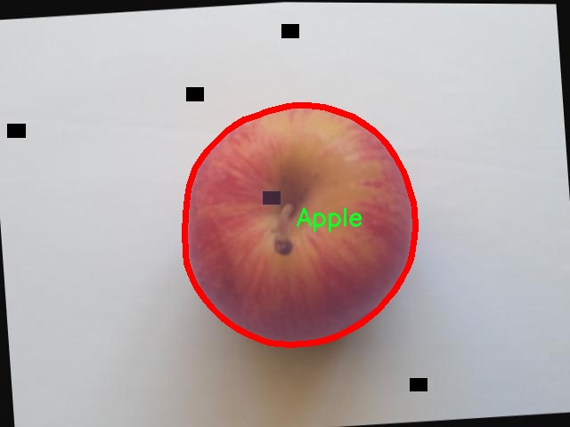
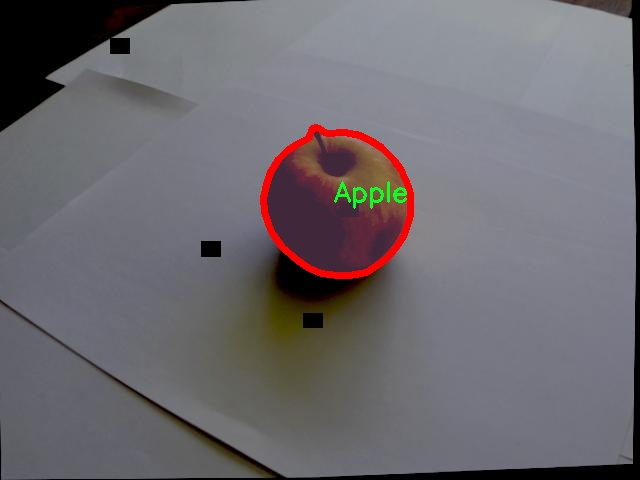
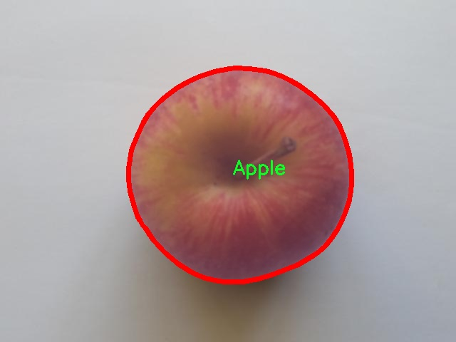

# 改进yolo11-RepNCSPELAN等200+全套创新点大全：厨房食材检测图像分割系统源码＆数据集全套

### 1.图片效果展示







##### 项目来源 **[人工智能促进会 2024.10.30](https://kdocs.cn/l/cszuIiCKVNis)**

注意：由于项目一直在更新迭代，上面“1.图片效果展示”和“2.视频效果展示”展示的系统图片或者视频可能为老版本，新版本在老版本的基础上升级如下：（实际效果以升级的新版本为准）

  （1）适配了YOLOV11的“目标检测”模型和“实例分割”模型，通过加载相应的权重（.pt）文件即可自适应加载模型。

  （2）支持“图片识别”、“视频识别”、“摄像头实时识别”三种识别模式。

  （3）支持“图片识别”、“视频识别”、“摄像头实时识别”三种识别结果保存导出，解决手动导出（容易卡顿出现爆内存）存在的问题，识别完自动保存结果并导出到tempDir中。

  （4）支持Web前端系统中的标题、背景图等自定义修改。

  另外本项目提供训练的数据集和训练教程,暂不提供权重文件（best.pt）,需要您按照教程进行训练后实现图片演示和Web前端界面演示的效果。

### 2.视频效果展示

[2.1 视频效果展示](https://www.bilibili.com/video/BV16VSEYDEUe/)

### 3.背景

研究背景与意义

随着智能家居和自动化厨房的迅速发展，厨房食材的智能识别与管理成为了一个重要的研究方向。传统的厨房管理方式往往依赖于人工识别和记录，不仅效率低下，而且容易出现错误。基于深度学习的图像识别技术，尤其是YOLO（You Only Look Once）系列模型，因其高效的实时检测能力而备受关注。YOLOv11作为该系列的最新版本，具备更强的特征提取能力和更快的处理速度，为厨房食材的自动识别提供了新的可能性。

本研究旨在基于改进的YOLOv11模型，构建一个厨房食材检测图像分割系统。该系统将利用包含4500张图像的多样化数据集，涵盖了包括苹果、米饭、黑胡椒、花椰菜等在内的四类食材。这些食材不仅在家庭烹饪中常见，也在健康饮食和营养管理中扮演着重要角色。通过对这些食材的精准识别与分割，系统能够实现对厨房库存的实时监控，帮助用户更好地管理食材，减少浪费，并提升烹饪效率。

此外，随着人们对健康饮食的关注，食材的种类和品质日益受到重视。通过引入深度学习技术，研究将推动厨房智能化的发展，提升用户的烹饪体验。该系统的实现不仅有助于家庭用户的日常生活，还可为餐饮行业提供数据支持，优化食材采购和库存管理，具有广泛的应用前景和市场价值。因此，本研究不仅具有重要的学术意义，也具备良好的实际应用潜力，为未来的智能厨房发展奠定基础。

### 4.数据集信息展示

##### 4.1 本项目数据集详细数据（类别数＆类别名）

nc: 32
names: ['Apple', 'Basmatirice', 'Blackpepper', 'Broccoli', 'Brownsugar', 'Butter', 'Buttermilk', 'Buttonmushroom', 'Cashewnut', 'Chickenstock', 'Cilantro', 'Cinnamon', 'Egg', 'Flour', 'Garlic', 'Greenpepper', 'Lemon', 'Mayonnaise', 'Medjooldates', 'Mustard', 'Onion', 'Peas', 'Potato', 'Redbeans', 'Redpepper', 'Salt', 'Springonion', 'Tomato', 'Vegetableoil', 'Whitesugar', 'milk', 'yeast']


该项目为【图像分割】数据集，请在【训练教程和Web端加载模型教程（第三步）】这一步的时候按照【图像分割】部分的教程来训练

##### 4.2 本项目数据集信息介绍

本项目数据集信息介绍

本项目所使用的数据集名为“Ingredients”，其主要目的是为了训练和改进YOLOv11的厨房食材检测图像分割系统。该数据集包含32个类别，涵盖了多种常见的厨房食材，旨在为图像分割任务提供丰富的样本和多样化的特征。这些类别包括了从新鲜水果到调味品、从干货到乳制品的多种食材，具体类别有：苹果、巴斯马蒂米、黑胡椒、西兰花、红糖、黄油、酪乳、按钮蘑菇、腰果、鸡肉高汤、香菜、肉桂、鸡蛋、面粉、大蒜、青椒、柠檬、蛋黄酱、梅德乔尔枣、芥末、洋葱、豌豆、土豆、红豆、红椒、盐、春洋葱、西红柿、植物油、白糖、牛奶和酵母等。

数据集的多样性使其能够有效地捕捉不同食材在各种烹饪场景中的外观特征，这对于提高YOLOv11在厨房环境中的检测精度至关重要。每个类别的食材都经过精心挑选，确保涵盖了家庭烹饪中常见的食材类型，从而增强模型的实用性和适应性。此外，数据集中的图像经过精细标注，确保每个食材的边界清晰，便于进行高质量的图像分割训练。

通过使用“Ingredients”数据集，研究团队期望能够提升YOLOv11在复杂厨房环境中的检测能力，使其能够准确识别和分割出各种食材。这不仅有助于自动化厨房管理，还为智能烹饪助手的开发奠定了基础。整体而言，该数据集的构建为图像分割技术在食品识别领域的应用提供了坚实的支持，推动了相关研究的深入发展。











### 5.全套项目环境部署视频教程（零基础手把手教学）

[5.1 所需软件PyCharm和Anaconda安装教程（第一步）](https://www.bilibili.com/video/BV1BoC1YCEKi/?spm_id_from=333.999.0.0&vd_source=bc9aec86d164b67a7004b996143742dc)


[5.2 安装Python虚拟环境创建和依赖库安装视频教程（第二步）](https://www.bilibili.com/video/BV1ZoC1YCEBw?spm_id_from=333.788.videopod.sections&vd_source=bc9aec86d164b67a7004b996143742dc)

### 6.改进YOLOv11训练教程和Web_UI前端加载模型教程（零基础手把手教学）

[6.1 改进YOLOv11训练教程和Web_UI前端加载模型教程（第三步）](https://www.bilibili.com/video/BV1BoC1YCEhR?spm_id_from=333.788.videopod.sections&vd_source=bc9aec86d164b67a7004b996143742dc)


按照上面的训练视频教程链接加载项目提供的数据集，运行train.py即可开始训练



     Epoch   gpu_mem       box       obj       cls    labels  img_size
     1/200     20.8G   0.01576   0.01955  0.007536        22      1280: 100%|██████████| 849/849 [14:42<00:00,  1.04s/it]
               Class     Images     Labels          P          R     mAP@.5 mAP@.5:.95: 100%|██████████| 213/213 [01:14<00:00,  2.87it/s]
                 all       3395      17314      0.994      0.957      0.0957      0.0843

     Epoch   gpu_mem       box       obj       cls    labels  img_size
     2/200     20.8G   0.01578   0.01923  0.007006        22      1280: 100%|██████████| 849/849 [14:44<00:00,  1.04s/it]
               Class     Images     Labels          P          R     mAP@.5 mAP@.5:.95: 100%|██████████| 213/213 [01:12<00:00,  2.95it/s]
                 all       3395      17314      0.996      0.956      0.0957      0.0845

     Epoch   gpu_mem       box       obj       cls    labels  img_size
     3/200     20.8G   0.01561    0.0191  0.006895        27      1280: 100%|██████████| 849/849 [10:56<00:00,  1.29it/s]
               Class     Images     Labels          P          R     mAP@.5 mAP@.5:.95: 100%|███████   | 187/213 [00:52<00:00,  4.04it/s]
                 all       3395      17314      0.996      0.957      0.0957      0.0845


###### [项目数据集下载链接](https://kdocs.cn/l/cszuIiCKVNis)

### 7.原始YOLOv11算法讲解


###### YOLOv11改进方向

与YOLOv 10相比，YOLOv 11有了巨大的改进，包括但不限于：

  * 增强的模型结构：模型具有改进的模型结构，以获取图像处理并形成预测
  * GPU优化：这是现代ML模型的反映，GPU训练ML模型在速度和准确性上都更好。
  * 速度：YOLOv 11模型现在经过增强和GPU优化以用于训练。通过优化，这些模型比它们的前版本快得多。在速度上达到了25%的延迟减少！
  * 更少的参数：更少的参数允许更快的模型，但v11的准确性不受影响
  * 更具适应性：更多支持的任务YOLOv 11支持多种类型的任务、多种类型的对象和多种类型的图像。

###### YOLOv11功能介绍

Glenn Jocher和他的团队制作了一个令人敬畏的YOLOv 11迭代，并且在图像人工智能的各个方面都提供了YOLO。YOLOv 11有多种型号，包括：

  * 对象检测-在训练时检测图像中的对象
  * 图像分割-超越对象检测，分割出图像中的对象
  * 姿态检测-当用点和线训练时绘制一个人的姿势
  * 定向检测（OBB）：类似于对象检测，但包围盒可以旋转
  * 图像分类-在训练时对图像进行分类

使用Ultralytics Library，这些模型还可以进行优化，以：

  * 跟踪-可以跟踪对象的路径
  * 易于导出-库可以以不同的格式和目的导出
  * 多场景-您可以针对不同的对象和图像训练模型

此外，Ultralytics还推出了YOLOv 11的企业模型，该模型将于10月31日发布。这将与开源的YOLOv
11模型并行，但将拥有更大的专有Ultralytics数据集。YOLOv 11是“建立在过去的成功”的其他版本的之上。

###### YOLOv11模型介绍

YOLOv 11附带了边界框模型（无后缀），实例分割（-seg），姿态估计（-pose），定向边界框（-obb）和分类（-cls）。

这些也有不同的尺寸：纳米（n），小（s），中（m），大（l），超大（x）。


YOLOv11模型

###### YOLOv11与前版本对比

与YOLOv10和YOLOv8相比，YOLOv11在Ultralytics的任何帖子中都没有直接提到。所以我会收集所有的数据来比较它们。感谢Ultralytics：

**检测：**


YOLOv11检测统计


YOLOv10检测统计

其中，Nano的mAPval在v11上为39.5，v10上为38.5；Small为47.0 vs 46.3，Medium为51.5 vs
51.1，Large为53.4 vs 53.2，Extra Large为54.7vs
54.4。现在，这可能看起来像是一种增量增加，但小小数的增加可能会对ML模型产生很大影响。总体而言，YOLOv11以0.3
mAPval的优势追平或击败YOLOv10。

现在，我们必须看看速度。在延迟方面，Nano在v11上为1.55 , v10上为1.84，Small为2.46 v2.49，Medium为4.70
v4.74，Large为6.16 v7.28，Extra Large为11.31
v10.70。延迟越低越好。YOLOv11提供了一个非常低的延迟相比，除了特大做得相当差的前身。

总的来说，Nano模型是令人振奋的，速度更快，性能相当。Extra Large在性能上有很好的提升，但它的延迟非常糟糕。

**分割：**


YOLOV11 分割统计


YOLOV9 分割统计


YOLOV8 分割数据

总体而言，YOLOv 11上的分割模型在大型和超大型模型方面比上一代YOLOv 8和YOLOv 9做得更好。

YOLOv 9 Segmentation没有提供任何关于延迟的统计数据。比较YOLOv 11延迟和YOLOv 8延迟，发现YOLOv 11比YOLOv
8快得多。YOLOv 11将大量GPU集成到他们的模型中，因此期望他们的模型甚至比CPU测试的基准更快！

姿态估计：


YOLOV11姿态估计统计


YOLOV8姿态估计统计

YOLOv 11的mAP 50 -95统计量也逐渐优于先前的YOLOv 8（除大型外）。然而，在速度方面，YOLOv
11姿势可以最大限度地减少延迟。其中一些延迟指标是版本的1/4！通过对这些模型进行GPU训练优化，我可以看到指标比显示的要好得多。

**定向边界框：**


YOLOv11 OBB统计


YOLOv8 OBB统计

OBB统计数据在mAP
50上并不是很好，只有非常小的改进，在某种程度上小于检测中的微小改进。然而，从v8到v11的速度减半，这表明YOLOv11在速度上做了很多努力。

**最后，分类：**


YOLOv 11 CLS统计


YOLOv8 CLS统计

从v8到v11，准确性也有了微小的提高。然而，速度大幅上升，CPU速度更快的型号。


### 8.200+种全套改进YOLOV11创新点原理讲解

#### 8.1 200+种全套改进YOLOV11创新点原理讲解大全

由于篇幅限制，每个创新点的具体原理讲解就不全部展开，具体见下列网址中的改进模块对应项目的技术原理博客网址【Blog】（创新点均为模块化搭建，原理适配YOLOv5~YOLOv11等各种版本）

[改进模块技术原理博客【Blog】网址链接](https://gitee.com/qunmasj/good)


#### 8.2 精选部分改进YOLOV11创新点原理讲解

###### 这里节选部分改进创新点展开原理讲解(完整的改进原理见上图和[改进模块技术原理博客链接](https://gitee.com/qunmasj/good)【如果此小节的图加载失败可以通过CSDN或者Github搜索该博客的标题访问原始博客，原始博客图片显示正常】
### CBAM空间注意力机制
近年来，随着深度学习研究方向的火热，注意力机制也被广泛地应用在图像识别、语音识别和自然语言处理等领域，注意力机制在深度学习任务中发挥着举足轻重的作用。注意力机制借鉴于人类的视觉系统，例如，人眼在看到一幅画面时，会倾向于关注画面中的重要信息，而忽略其他可见的信息。深度学习中的注意力机制和人类视觉的注意力机制相似，通过扫描全局数据，从大量数据中选择出需要重点关注的、对当前任务更为重要的信息，然后对这部分信息分配更多的注意力资源，从这些信息中获取更多所需要的细节信息，而抑制其他无用的信息。而在深度学习中，则具体表现为给感兴趣的区域更高的权重，经过网络的学习和调整，得到最优的权重分配，形成网络模型的注意力，使网络拥有更强的学习能力，加快网络的收敛速度。
注意力机制通常可分为软注意力机制和硬注意力机制[4-5]。软注意力机制在选择信息时，不是从输入的信息中只选择1个，而会用到所有输入信息，只是各个信息对应的权重分配不同，然后输入网络模型进行计算;硬注意力机制则是从输入的信息中随机选取一个或者选择概率最高的信息，但是这一步骤通常是不可微的，导致硬注意力机制更难训练。因此，软注意力机制应用更为广泛，按照原理可将软注意力机制划分为:通道注意力机制（channel attention)、空间注意力机制(spatial attention）和混合域注意力机制(mixed attention)。
通道注意力机制的本质建立各个特征通道之间的重要程度，对感兴趣的通道进行重点关注，弱化不感兴趣的通道的作用;空间注意力的本质则是建模了整个空间信息的重要程度，然后对空间内感兴趣的区域进行重点关注，弱化其余非感兴趣区域的作用;混合注意力同时运用了通道注意力和空间注意力，两部分先后进行或并行，形成对通道特征和空间特征同时关注的注意力模型。

卷积层注意力模块(Convolutional Block Attention Module，CBAM）是比较常用的混合注意力模块，其先后集中了通道注意力模块和空间注意力模块，网络中加入该模块能有效提高网络性能，减少网络模型的计算量，模块结构如图所示。输入特征图首先经过分支的通道注意力模块，然后和主干的原特征图融合，得到具有通道注意力的特征图，接着经过分支的空间注意力模块，在和主干的特征图融合后，得到同时具有通道特征注意力和空间特征注意力的特征图。CBAM模块不改变输入特征图的大小，因此该模块是一个“即插即用”的模块，可以插入网络的任何位置。

通道注意力模块的结构示意图如图所示，通道注意力模块分支并行地对输入的特征图进行最大池化操作和平均池化操作，然后利用多层感知机对结果进行变换，得到应用于两个通道的变换结果，最后经过sigmoid激活函数将变换结果融合，得到具有通道注意力的通道特征图。

空间注意力模块示意图如图所示，将通道注意力模块输出的特征图作为该模块的输入特征图，首先对输入特征图进行基于通道的最大池化操作和平均池化操作，将两部分得到的结果拼接起来，然后通过卷积得到降为Ⅰ通道的特征图，最后通过sigmoid激活函数生成具有空间注意力的特征图。


### 9.系统功能展示

图9.1.系统支持检测结果表格显示

  图9.2.系统支持置信度和IOU阈值手动调节

  图9.3.系统支持自定义加载权重文件best.pt(需要你通过步骤5中训练获得)

  图9.4.系统支持摄像头实时识别

  图9.5.系统支持图片识别

  图9.6.系统支持视频识别

  图9.7.系统支持识别结果文件自动保存

  图9.8.系统支持Excel导出检测结果数据


### 10. YOLOv11核心改进源码讲解

#### 10.1 wtconv2d.py

以下是对代码中最核心部分的分析和详细注释。代码的主要功能是实现一个基于小波变换的卷积层（`WTConv2d`），并提供小波变换和逆小波变换的功能。

```python
import torch
import torch.nn as nn
import torch.nn.functional as F
from torch.autograd import Function
import pywt

# 创建小波滤波器
def create_wavelet_filter(wave, in_size, out_size, type=torch.float):
    # 创建小波对象
    w = pywt.Wavelet(wave)
    
    # 获取小波的分解滤波器
    dec_hi = torch.tensor(w.dec_hi[::-1], dtype=type)  # 高频滤波器
    dec_lo = torch.tensor(w.dec_lo[::-1], dtype=type)  # 低频滤波器
    
    # 生成分解滤波器的组合
    dec_filters = torch.stack([
        dec_lo.unsqueeze(0) * dec_lo.unsqueeze(1),
        dec_lo.unsqueeze(0) * dec_hi.unsqueeze(1),
        dec_hi.unsqueeze(0) * dec_lo.unsqueeze(1),
        dec_hi.unsqueeze(0) * dec_hi.unsqueeze(1)
    ], dim=0)

    # 扩展滤波器以适应输入通道数
    dec_filters = dec_filters[:, None].repeat(in_size, 1, 1, 1)

    # 获取小波的重构滤波器
    rec_hi = torch.tensor(w.rec_hi[::-1], dtype=type).flip(dims=[0])
    rec_lo = torch.tensor(w.rec_lo[::-1], dtype=type).flip(dims=[0])
    
    # 生成重构滤波器的组合
    rec_filters = torch.stack([
        rec_lo.unsqueeze(0) * rec_lo.unsqueeze(1),
        rec_lo.unsqueeze(0) * rec_hi.unsqueeze(1),
        rec_hi.unsqueeze(0) * rec_lo.unsqueeze(1),
        rec_hi.unsqueeze(0) * rec_hi.unsqueeze(1)
    ], dim=0)

    # 扩展滤波器以适应输出通道数
    rec_filters = rec_filters[:, None].repeat(out_size, 1, 1, 1)

    return dec_filters, rec_filters

# 小波变换
def wavelet_transform(x, filters):
    b, c, h, w = x.shape  # 获取输入的形状
    pad = (filters.shape[2] // 2 - 1, filters.shape[3] // 2 - 1)  # 计算填充
    # 进行卷积操作
    x = F.conv2d(x, filters.to(x.dtype).to(x.device), stride=2, groups=c, padding=pad)
    x = x.reshape(b, c, 4, h // 2, w // 2)  # 重新调整形状
    return x

# 逆小波变换
def inverse_wavelet_transform(x, filters):
    b, c, _, h_half, w_half = x.shape  # 获取输入的形状
    pad = (filters.shape[2] // 2 - 1, filters.shape[3] // 2 - 1)  # 计算填充
    x = x.reshape(b, c * 4, h_half, w_half)  # 重新调整形状
    # 进行转置卷积操作
    x = F.conv_transpose2d(x, filters.to(x.dtype).to(x.device), stride=2, groups=c, padding=pad)
    return x

# 定义小波变换的函数
class WaveletTransform(Function):
    @staticmethod
    def forward(ctx, input, filters):
        ctx.filters = filters  # 保存滤波器
        with torch.no_grad():
            x = wavelet_transform(input, filters)  # 执行小波变换
        return x

    @staticmethod
    def backward(ctx, grad_output):
        grad = inverse_wavelet_transform(grad_output, ctx.filters)  # 计算梯度
        return grad, None

# 定义逆小波变换的函数
class InverseWaveletTransform(Function):
    @staticmethod
    def forward(ctx, input, filters):
        ctx.filters = filters  # 保存滤波器
        with torch.no_grad():
            x = inverse_wavelet_transform(input, filters)  # 执行逆小波变换
        return x

    @staticmethod
    def backward(ctx, grad_output):
        grad = wavelet_transform(grad_output, ctx.filters)  # 计算梯度
        return grad, None

# 定义基于小波变换的卷积层
class WTConv2d(nn.Module):
    def __init__(self, in_channels, out_channels, kernel_size=5, stride=1, bias=True, wt_levels=1, wt_type='db1'):
        super(WTConv2d, self).__init__()

        assert in_channels == out_channels  # 输入通道数必须等于输出通道数

        self.in_channels = in_channels
        self.wt_levels = wt_levels
        self.stride = stride

        # 创建小波滤波器
        self.wt_filter, self.iwt_filter = create_wavelet_filter(wt_type, in_channels, in_channels, torch.float)
        self.wt_filter = nn.Parameter(self.wt_filter, requires_grad=False)  # 不需要训练的小波滤波器
        self.iwt_filter = nn.Parameter(self.iwt_filter, requires_grad=False)  # 不需要训练的逆小波滤波器
        
        # 初始化小波变换和逆小波变换的函数
        self.wt_function = wavelet_transform_init(self.wt_filter)
        self.iwt_function = inverse_wavelet_transform_init(self.iwt_filter)

        # 基础卷积层
        self.base_conv = nn.Conv2d(in_channels, in_channels, kernel_size, padding='same', stride=1, groups=in_channels, bias=bias)
        self.base_scale = _ScaleModule([1, in_channels, 1, 1])  # 缩放模块

        # 小波卷积层
        self.wavelet_convs = nn.ModuleList(
            [nn.Conv2d(in_channels * 4, in_channels * 4, kernel_size, padding='same', stride=1, groups=in_channels * 4, bias=False) for _ in range(self.wt_levels)]
        )
        self.wavelet_scale = nn.ModuleList(
            [_ScaleModule([1, in_channels * 4, 1, 1], init_scale=0.1) for _ in range(self.wt_levels)]
        )

        # 如果步幅大于1，定义步幅操作
        if self.stride > 1:
            self.stride_filter = nn.Parameter(torch.ones(in_channels, 1, 1, 1), requires_grad=False)
            self.do_stride = lambda x_in: F.conv2d(x_in, self.stride_filter.to(x_in.dtype).to(x_in.device), bias=None, stride=self.stride, groups=in_channels)
        else:
            self.do_stride = None

    def forward(self, x):
        # 前向传播
        x_ll_in_levels = []  # 存储低频信息
        x_h_in_levels = []   # 存储高频信息
        shapes_in_levels = [] # 存储形状信息

        curr_x_ll = x  # 当前低频输入

        # 小波变换阶段
        for i in range(self.wt_levels):
            curr_shape = curr_x_ll.shape
            shapes_in_levels.append(curr_shape)  # 记录当前形状
            if (curr_shape[2] % 2 > 0) or (curr_shape[3] % 2 > 0):
                curr_pads = (0, curr_shape[3] % 2, 0, curr_shape[2] % 2)  # 处理奇数尺寸
                curr_x_ll = F.pad(curr_x_ll, curr_pads)  # 填充

            curr_x = self.wt_function(curr_x_ll)  # 执行小波变换
            curr_x_ll = curr_x[:, :, 0, :, :]  # 取低频部分
            
            shape_x = curr_x.shape
            curr_x_tag = curr_x.reshape(shape_x[0], shape_x[1] * 4, shape_x[3], shape_x[4])  # 重新调整形状
            curr_x_tag = self.wavelet_scale[i](self.wavelet_convs[i](curr_x_tag))  # 执行小波卷积
            curr_x_tag = curr_x_tag.reshape(shape_x)  # 还原形状

            x_ll_in_levels.append(curr_x_tag[:, :, 0, :, :])  # 存储低频信息
            x_h_in_levels.append(curr_x_tag[:, :, 1:4, :, :])  # 存储高频信息

        next_x_ll = 0  # 初始化下一个低频输出

        # 逆小波变换阶段
        for i in range(self.wt_levels - 1, -1, -1):
            curr_x_ll = x_ll_in_levels.pop()  # 取出低频信息
            curr_x_h = x_h_in_levels.pop()  # 取出高频信息
            curr_shape = shapes_in_levels.pop()  # 取出形状信息

            curr_x_ll = curr_x_ll + next_x_ll  # 结合当前低频和上一个低频

            curr_x = torch.cat([curr_x_ll.unsqueeze(2), curr_x_h], dim=2)  # 合并低频和高频信息
            next_x_ll = self.iwt_function(curr_x)  # 执行逆小波变换

            next_x_ll = next_x_ll[:, :, :curr_shape[2], :curr_shape[3]]  # 修剪到原始形状

        x_tag = next_x_ll  # 得到最终输出
        assert len(x_ll_in_levels) == 0  # 确保低频信息已处理完
        
        x = self.base_scale(self.base_conv(x))  # 执行基础卷积和缩放
        x = x + x_tag  # 合并小波变换结果
        
        if self.do_stride is not None:
            x = self.do_stride(x)  # 如果有步幅，执行步幅操作

        return x

# 定义缩放模块
class _ScaleModule(nn.Module):
    def __init__(self, dims, init_scale=1.0, init_bias=0):
        super(_ScaleModule, self).__init__()
        self.dims = dims
        self.weight = nn.Parameter(torch.ones(*dims) * init_scale)  # 初始化权重
        self.bias = None  # 暂不使用偏置
    
    def forward(self, x):
        return torch.mul(self.weight, x)  # 执行缩放操作
```

### 代码核心部分分析：
1. **小波滤波器的创建**：`create_wavelet_filter` 函数用于生成小波变换和逆变换所需的滤波器，利用 `pywt` 库来获取小波的分解和重构滤波器。
2. **小波变换和逆小波变换**：`wavelet_transform` 和 `inverse_wavelet_transform` 函数实现了小波变换和逆变换的具体操作，使用卷积和转置卷积来处理输入数据。
3. **自定义的函数**：`WaveletTransform` 和 `InverseWaveletTransform` 类继承自 `Function`，实现了小波变换和逆变换的前向和反向传播逻辑。
4. **WTConv2d 类**：这是核心的卷积层实现，结合了小波变换和基础卷积，能够处理多层小波变换，支持不同的步幅和层数。
5. **缩放模块**：`_ScaleModule` 类用于对卷积输出进行缩放，确保输出的数值范围适合后续处理。

整体来看，这段代码实现了一个结合小波变换的卷积层，能够在深度学习模型中有效地提取多尺度特征。

这个文件 `wtconv2d.py` 实现了一个基于小波变换的二维卷积层，主要用于图像处理和特征提取。它结合了小波变换和传统卷积操作，提供了一种新的方式来处理图像数据。

首先，文件导入了必要的库，包括 PyTorch 和 PyWavelets。接着，定义了一些辅助函数和类。`create_wavelet_filter` 函数用于生成小波变换和逆小波变换所需的滤波器。这些滤波器是通过指定的小波类型（如 Daubechies 小波）来创建的，并根据输入和输出通道的数量进行适当的调整。

`wavelet_transform` 和 `inverse_wavelet_transform` 函数分别实现了小波变换和逆小波变换的操作。它们使用了 PyTorch 的卷积函数，利用小波滤波器对输入数据进行处理，并通过适当的重塑操作来调整输出的形状。

接下来，定义了两个类 `WaveletTransform` 和 `InverseWaveletTransform`，它们继承自 `torch.autograd.Function`。这两个类实现了前向和反向传播的逻辑，允许在训练过程中计算梯度。前向传播中调用了小波变换或逆小波变换，而反向传播则计算相应的梯度。

`wavelet_transform_init` 和 `inverse_wavelet_transform_init` 函数用于初始化小波变换和逆小波变换的应用函数，这些函数在后续的卷积操作中被调用。

`WTConv2d` 类是这个模块的核心部分，继承自 `nn.Module`。在初始化方法中，设置了输入和输出通道数、卷积核大小、步幅等参数，并创建了小波滤波器和逆小波滤波器。该类还定义了基本的卷积层和多个小波卷积层，以及用于处理步幅的操作。

在 `forward` 方法中，首先对输入数据进行小波变换，并将结果分为低频和高频部分。然后，依次对每一层的小波变换结果进行卷积和缩放操作。最后，通过逆小波变换将结果合并，得到最终的输出。

`_ScaleModule` 类是一个简单的缩放模块，用于对输入进行缩放操作，通常用于调整卷积输出的尺度。

总体来说，这个文件实现了一个复杂的卷积层，通过结合小波变换和传统卷积，提供了一种新的图像处理方法，能够有效提取图像特征并进行多层次的处理。

#### 10.2 pkinet.py

以下是代码中最核心的部分，并附上详细的中文注释：

```python
import math
import torch
import torch.nn as nn

class DropPath(nn.Module):
    """实现随机深度（Drop Path）功能的模块。
    
    随机深度是一种正则化技术，用于在训练过程中随机丢弃某些路径，以减少过拟合。
    
    Args:
        drop_prob (float): 被丢弃路径的概率。默认值为0.1。
    """

    def __init__(self, drop_prob: float = 0.1):
        super().__init__()
        self.drop_prob = drop_prob  # 存储丢弃概率

    def forward(self, x: torch.Tensor) -> torch.Tensor:
        """前向传播函数，应用随机深度。
        
        Args:
            x (torch.Tensor): 输入张量。
        
        Returns:
            torch.Tensor: 经过随机深度处理后的输出张量。
        """
        if self.drop_prob == 0. or not self.training:  # 如果丢弃概率为0或不在训练模式下，直接返回输入
            return x
        keep_prob = 1 - self.drop_prob  # 计算保留概率
        shape = (x.shape[0], ) + (1, ) * (x.ndim - 1)  # 处理不同维度的张量
        random_tensor = keep_prob + torch.rand(shape, dtype=x.dtype, device=x.device)  # 生成随机张量
        output = x.div(keep_prob) * random_tensor.floor()  # 应用随机深度
        return output

class PKINet(nn.Module):
    """多核心卷积网络（Poly Kernel Inception Network）类。
    
    该网络使用多个不同大小的卷积核进行特征提取，结合了Inception模块的思想。
    
    Args:
        arch (str): 网络架构类型。可选值为'T', 'S', 'B'。
        out_indices (Sequence[int]): 输出的层索引。
        drop_path_rate (float): 随机深度的丢弃概率。
        frozen_stages (int): 冻结的阶段索引。
        norm_eval (bool): 是否在评估模式下使用归一化。
        norm_cfg (Optional[dict]): 归一化层的配置字典。
        act_cfg (Optional[dict]): 激活函数的配置字典。
        init_cfg (Optional[dict]): 权重初始化配置字典。
    """

    def __init__(self, arch: str = 'S', out_indices: Sequence[int] = (0, 1, 2, 3, 4), drop_path_rate: float = 0.1):
        super().__init__()
        self.out_indices = out_indices  # 输出层索引
        self.stages = nn.ModuleList()  # 存储网络的各个阶段

        # 初始化网络的各个阶段
        # 这里省略了具体的阶段初始化过程

    def forward(self, x):
        """前向传播函数，执行网络的前向计算。
        
        Args:
            x (torch.Tensor): 输入张量。
        
        Returns:
            tuple: 各个输出层的结果。
        """
        outs = []  # 存储输出结果
        for i, stage in enumerate(self.stages):
            x = stage(x)  # 通过每个阶段处理输入
            if i in self.out_indices:  # 如果当前阶段在输出索引中
                outs.append(x)  # 将输出添加到结果列表中
        return tuple(outs)  # 返回输出结果

def PKINET_T():
    """构建并返回T类型的PKINet模型。"""
    return PKINet('T')

def PKINET_S():
    """构建并返回S类型的PKINet模型。"""
    return PKINet('S')

def PKINET_B():
    """构建并返回B类型的PKINet模型。"""
    return PKINet('B')

if __name__ == '__main__':
    model = PKINET_T()  # 创建T类型的PKINet模型
    inputs = torch.randn((1, 3, 640, 640))  # 创建随机输入张量
    res = model(inputs)  # 通过模型进行前向传播
    for i in res:
        print(i.size())  # 打印每个输出的尺寸
```

### 代码核心部分解释：
1. **DropPath 类**：实现了随机深度的功能，通过在训练过程中随机丢弃某些路径来防止过拟合。
2. **PKINet 类**：构建了多核心卷积网络，包含多个阶段的特征提取模块。根据不同的架构类型（T、S、B）初始化不同的网络结构。
3. **前向传播**：在 `PKINet` 的 `forward` 方法中，依次通过每个阶段处理输入，并根据输出索引返回相应的输出结果。
4. **模型构建函数**：提供了方便的函数来创建不同类型的 `PKINet` 模型。

这个程序文件 `pkinet.py` 实现了一个名为 PKINet 的深度学习模型，主要用于计算机视觉任务。该模型基于多核（Poly Kernel）卷积和注意力机制，具有较高的灵活性和可扩展性。以下是对文件中各个部分的详细说明。

首先，文件导入了一些必要的库，包括 `math`、`torch` 和 `torch.nn`，以及一些可能的第三方库（如 `mmcv` 和 `mmengine`），用于构建神经网络模块和处理模型参数初始化。若这些库未安装，则会捕获导入错误并继续执行。

接下来，定义了一些辅助函数和类。`drop_path` 函数实现了随机深度（Stochastic Depth）技术，用于在训练过程中随机丢弃某些路径，以增强模型的泛化能力。`DropPath` 类则是对这一功能的封装，继承自 `nn.Module`。

`autopad` 函数用于自动计算卷积操作的填充，以确保输出的空间维度与输入一致。`make_divisible` 函数则用于确保通道数可以被指定的因子整除，通常用于卷积层的通道数调整。

接下来的几个类 `BCHW2BHWC` 和 `BHWC2BCHW` 用于在不同的张量维度格式之间转换，`GSiLU` 实现了一种新的激活函数，结合了全局平均池化和 Sigmoid 函数。

`CAA` 类实现了上下文锚点注意力机制（Context Anchor Attention），用于增强特征的表达能力。`ConvFFN` 类实现了一个多层感知机（MLP），通过卷积模块构建，适用于特征变换。

`Stem` 和 `DownSamplingLayer` 类分别实现了模型的初始层和下采样层，负责特征的初步提取和尺寸的缩小。`InceptionBottleneck` 类则实现了带有 Inception 模块的瓶颈结构，支持多种卷积核大小和扩展因子。

`PKIBlock` 类是模型的核心构建块，结合了前面提到的组件，形成了多核卷积的复合结构。`PKIStage` 类则是由多个 `PKIBlock` 组成的阶段，负责处理特征的多层次提取。

最后，`PKINet` 类是整个模型的封装，定义了网络的结构和前向传播过程。它支持多种架构设置（如 T、S、B），并在初始化时根据指定的架构设置构建相应的层次结构。模型的权重初始化通过 `init_weights` 方法进行，确保各层的参数在训练开始时具有合理的初始值。

在文件的最后部分，定义了三个函数 `PKINET_T`、`PKINET_S` 和 `PKINET_B`，用于实例化不同版本的 PKINet 模型。`__main__` 部分则是一个简单的测试示例，创建了一个 PKINET_T 模型，并生成了随机输入进行前向传播，输出每个阶段的特征图尺寸。

总体而言，这个文件实现了一个复杂的深度学习模型，结合了多种现代卷积神经网络的设计理念，适用于图像处理和计算机视觉任务。

#### 10.3 RFAConv.py

以下是保留的核心代码部分，并附上详细的中文注释：

```python
import torch
import torch.nn as nn
from einops import rearrange

class h_sigmoid(nn.Module):
    """实现h-sigmoid激活函数"""
    def __init__(self, inplace=True):
        super(h_sigmoid, self).__init__()
        self.relu = nn.ReLU6(inplace=inplace)  # 使用ReLU6作为基础

    def forward(self, x):
        return self.relu(x + 3) / 6  # 计算h-sigmoid

class h_swish(nn.Module):
    """实现h-swish激活函数"""
    def __init__(self, inplace=True):
        super(h_swish, self).__init__()
        self.sigmoid = h_sigmoid(inplace=inplace)  # 使用h-sigmoid作为基础

    def forward(self, x):
        return x * self.sigmoid(x)  # 计算h-swish

class RFAConv(nn.Module):
    """实现RFA卷积模块"""
    def __init__(self, in_channel, out_channel, kernel_size, stride=1):
        super().__init__()
        self.kernel_size = kernel_size

        # 权重生成模块
        self.get_weight = nn.Sequential(
            nn.AvgPool2d(kernel_size=kernel_size, padding=kernel_size // 2, stride=stride),
            nn.Conv2d(in_channel, in_channel * (kernel_size ** 2), kernel_size=1, groups=in_channel, bias=False)
        )
        
        # 特征生成模块
        self.generate_feature = nn.Sequential(
            nn.Conv2d(in_channel, in_channel * (kernel_size ** 2), kernel_size=kernel_size, padding=kernel_size // 2, stride=stride, groups=in_channel, bias=False),
            nn.BatchNorm2d(in_channel * (kernel_size ** 2)),
            nn.ReLU()
        )
        
        # 最终卷积层
        self.conv = nn.Conv2d(in_channel, out_channel, kernel_size=kernel_size, stride=kernel_size)

    def forward(self, x):
        b, c = x.shape[0:2]  # 获取输入的批次大小和通道数
        weight = self.get_weight(x)  # 生成权重
        h, w = weight.shape[2:]  # 获取特征图的高和宽
        
        # 计算加权特征
        weighted = weight.view(b, c, self.kernel_size ** 2, h, w).softmax(2)  # 对权重进行softmax处理
        feature = self.generate_feature(x).view(b, c, self.kernel_size ** 2, h, w)  # 生成特征
        
        # 计算加权后的特征
        weighted_data = feature * weighted
        conv_data = rearrange(weighted_data, 'b c (n1 n2) h w -> b c (h n1) (w n2)', n1=self.kernel_size, n2=self.kernel_size)  # 重排数据
        
        return self.conv(conv_data)  # 返回卷积结果

class SE(nn.Module):
    """实现Squeeze-and-Excitation模块"""
    def __init__(self, in_channel, ratio=16):
        super(SE, self).__init__()
        self.gap = nn.AdaptiveAvgPool2d((1, 1))  # 全局平均池化
        self.fc = nn.Sequential(
            nn.Linear(in_channel, in_channel // ratio, bias=False),  # 从c到c/r
            nn.ReLU(),
            nn.Linear(in_channel // ratio, in_channel, bias=False),  # 从c/r到c
            nn.Sigmoid()
        )

    def forward(self, x):
        b, c = x.shape[0:2]  # 获取输入的批次大小和通道数
        y = self.gap(x).view(b, c)  # 进行全局平均池化并调整形状
        y = self.fc(y).view(b, c, 1, 1)  # 通过全连接层
        return y  # 返回通道注意力

class RFCBAMConv(nn.Module):
    """实现RFCBAM卷积模块"""
    def __init__(self, in_channel, out_channel, kernel_size=3, stride=1):
        super().__init__()
        self.kernel_size = kernel_size
        
        # 特征生成模块
        self.generate = nn.Sequential(
            nn.Conv2d(in_channel, in_channel * (kernel_size ** 2), kernel_size, padding=kernel_size // 2, stride=stride, groups=in_channel, bias=False),
            nn.BatchNorm2d(in_channel * (kernel_size ** 2)),
            nn.ReLU()
        )
        
        # 权重生成模块
        self.get_weight = nn.Sequential(nn.Conv2d(2, 1, kernel_size=3, padding=1, bias=False), nn.Sigmoid())
        self.se = SE(in_channel)  # Squeeze-and-Excitation模块

        # 最终卷积层
        self.conv = nn.Conv2d(in_channel, out_channel, kernel_size=kernel_size, stride=kernel_size)

    def forward(self, x):
        b, c = x.shape[0:2]  # 获取输入的批次大小和通道数
        channel_attention = self.se(x)  # 计算通道注意力
        generate_feature = self.generate(x)  # 生成特征

        h, w = generate_feature.shape[2:]  # 获取特征图的高和宽
        generate_feature = generate_feature.view(b, c, self.kernel_size ** 2, h, w)  # 调整形状
        
        generate_feature = rearrange(generate_feature, 'b c (n1 n2) h w -> b c (h n1) (w n2)', n1=self.kernel_size, n2=self.kernel_size)  # 重排数据
        
        # 计算加权特征
        unfold_feature = generate_feature * channel_attention
        max_feature, _ = torch.max(generate_feature, dim=1, keepdim=True)  # 计算最大特征
        mean_feature = torch.mean(generate_feature, dim=1, keepdim=True)  # 计算均值特征
        receptive_field_attention = self.get_weight(torch.cat((max_feature, mean_feature), dim=1))  # 计算感受野注意力
        conv_data = unfold_feature * receptive_field_attention  # 加权特征
        
        return self.conv(conv_data)  # 返回卷积结果
```

### 代码说明：
1. **h_sigmoid 和 h_swish**：实现了h-sigmoid和h-swish激活函数，常用于轻量级神经网络中。
2. **RFAConv**：实现了RFA卷积模块，通过生成特征和权重来增强特征表达能力。
3. **SE**：实现了Squeeze-and-Excitation模块，用于通道注意力机制。
4. **RFCBAMConv**：实现了RFCBAM卷积模块，结合了特征生成、通道注意力和感受野注意力机制。

这些模块可以用于构建更复杂的神经网络，增强网络的特征提取能力和表达能力。

这个程序文件 `RFAConv.py` 实现了一些基于卷积神经网络的模块，主要包括 RFAConv、RFCBAMConv 和 RFCAConv。这些模块结合了注意力机制和卷积操作，旨在提升特征提取的能力。

首先，文件中定义了两个激活函数模块：`h_sigmoid` 和 `h_swish`。`h_sigmoid` 是一种改进的 sigmoid 函数，使用了 ReLU6 作为基础，能够在输入范围内进行平滑处理。`h_swish` 则是将 `h_sigmoid` 应用于输入，形成了一种新的激活函数。

接下来是 `RFAConv` 类的定义。这个类的构造函数中定义了几个主要的子模块，包括一个用于生成权重的卷积层和一个用于生成特征的卷积层。`forward` 方法中，输入数据经过权重生成和特征生成后，利用 softmax 计算权重并与特征相乘，最后通过重排和卷积操作输出结果。

`SE` 类实现了 Squeeze-and-Excitation (SE) 模块。它通过全局平均池化和全连接层来计算通道注意力，输出的注意力权重用于增强特征图中的重要通道。

`RFCBAMConv` 类是一个结合了 SE 模块的卷积层。它首先生成特征，然后计算通道注意力，接着利用最大池化和平均池化来生成感受野注意力，最后将这些注意力应用于生成的特征上，输出经过卷积处理的结果。

最后，`RFCAConv` 类实现了一个结合了空间和通道注意力的卷积模块。它通过生成特征、池化操作和全连接层来计算注意力权重，并将这些权重应用于生成的特征图，最终通过卷积层输出结果。

整体来看，这个文件中的模块通过引入注意力机制，增强了卷积神经网络在特征提取过程中的表现，适用于各种计算机视觉任务。

#### 10.4 UniRepLKNet.py

以下是代码中最核心的部分，并附上详细的中文注释：

```python
import torch
import torch.nn as nn
import torch.nn.functional as F

class GRNwithNHWC(nn.Module):
    """ 
    GRN (Global Response Normalization) 层
    该层在 ConvNeXt V2 中首次提出，旨在提高模型的性能。
    输入假设为 (N, H, W, C) 格式。
    """
    def __init__(self, dim, use_bias=True):
        super().__init__()
        self.use_bias = use_bias
        # 初始化可学习参数 gamma 和 beta
        self.gamma = nn.Parameter(torch.zeros(1, 1, 1, dim))
        if self.use_bias:
            self.beta = nn.Parameter(torch.zeros(1, 1, 1, dim))

    def forward(self, x):
        # 计算输入的 L2 范数
        Gx = torch.norm(x, p=2, dim=(1, 2), keepdim=True)
        # 归一化
        Nx = Gx / (Gx.mean(dim=-1, keepdim=True) + 1e-6)
        # 应用归一化和可学习参数
        if self.use_bias:
            return (self.gamma * Nx + 1) * x + self.beta
        else:
            return (self.gamma * Nx + 1) * x


class SEBlock(nn.Module):
    """
    Squeeze-and-Excitation Block，提出于 SENet 中
    输入假设为 (N, C, H, W) 格式。
    """
    def __init__(self, input_channels, internal_neurons):
        super(SEBlock, self).__init__()
        # 下采样卷积
        self.down = nn.Conv2d(in_channels=input_channels, out_channels=internal_neurons,
                              kernel_size=1, stride=1, bias=True)
        # 上采样卷积
        self.up = nn.Conv2d(in_channels=internal_neurons, out_channels=input_channels,
                            kernel_size=1, stride=1, bias=True)
        self.input_channels = input_channels
        self.nonlinear = nn.ReLU(inplace=True)

    def forward(self, inputs):
        # 自适应平均池化
        x = F.adaptive_avg_pool2d(inputs, output_size=(1, 1))
        x = self.down(x)  # 下采样
        x = self.nonlinear(x)  # 激活
        x = self.up(x)  # 上采样
        x = F.sigmoid(x)  # Sigmoid 激活
        return inputs * x.view(-1, self.input_channels, 1, 1)  # 逐通道缩放


class UniRepLKNetBlock(nn.Module):
    """
    UniRepLKNet 的基本构建块
    包含卷积、归一化、激活等操作。
    """
    def __init__(self, dim, kernel_size, drop_path=0., deploy=False, use_sync_bn=False):
        super().__init__()
        # 深度卷积
        self.dwconv = nn.Conv2d(dim, dim, kernel_size=kernel_size, stride=1, padding=kernel_size // 2,
                                 dilation=1, groups=dim, bias=deploy)
        # 归一化层
        self.norm = nn.BatchNorm2d(dim) if not deploy else nn.Identity()
        # Squeeze-and-Excitation 模块
        self.se = SEBlock(dim, dim // 4)
        # 前馈网络
        self.pwconv1 = nn.Linear(dim, dim * 4)
        self.act = nn.GELU()
        self.pwconv2 = nn.Linear(dim * 4, dim)

        self.drop_path = nn.Identity() if drop_path <= 0. else nn.Dropout(drop_path)

    def forward(self, inputs):
        # 逐层前向传播
        x = self.dwconv(inputs)  # 深度卷积
        x = self.norm(x)  # 归一化
        x = self.se(x)  # Squeeze-and-Excitation
        x = self.pwconv1(x)  # 前馈网络
        x = self.act(x)  # 激活
        x = self.pwconv2(x)  # 输出
        return self.drop_path(x) + inputs  # 残差连接


class UniRepLKNet(nn.Module):
    """
    UniRepLKNet 模型的主类
    包含多个 UniRepLKNetBlock 以构建深度网络。
    """
    def __init__(self, in_chans=3, num_classes=1000, depths=(3, 3, 27, 3), dims=(96, 192, 384, 768)):
        super().__init__()
        self.stages = nn.ModuleList()
        for i in range(len(depths)):
            # 每个阶段添加多个 UniRepLKNetBlock
            stage = nn.Sequential(*[UniRepLKNetBlock(dim=dims[i], kernel_size=3) for _ in range(depths[i])])
            self.stages.append(stage)

    def forward(self, x):
        # 前向传播
        for stage in self.stages:
            x = stage(x)  # 逐阶段前向传播
        return x  # 返回最终输出


# 实例化模型并进行前向传播
if __name__ == '__main__':
    inputs = torch.randn((1, 3, 640, 640))  # 随机输入
    model = UniRepLKNet()  # 创建模型实例
    res = model(inputs)  # 前向传播
    print(res.shape)  # 输出结果的形状
```

### 代码核心部分说明：
1. **GRNwithNHWC**: 实现了全局响应归一化层，能够自适应地调整输入特征的分布。
2. **SEBlock**: 实现了Squeeze-and-Excitation模块，通过学习通道间的关系来增强特征表示。
3. **UniRepLKNetBlock**: 该模块是UniRepLKNet的基本构建块，包含深度卷积、归一化、激活和前馈网络，支持残差连接。
4. **UniRepLKNet**: 这是整个模型的主类，负责构建多个阶段，每个阶段由多个UniRepLKNetBlock组成，并在前向传播中逐层处理输入。

通过这些核心部分的组合，UniRepLKNet能够有效地处理各种输入数据并进行特征提取。

这个程序文件实现了一个名为UniRepLKNet的深度学习模型，主要用于音频、视频、点云、时间序列和图像识别。该模型基于多个先进的深度学习架构，包括RepLKNet、ConvNeXt、DINO和DeiT等。文件中包含了多个类和函数，下面是对其主要部分的详细说明。

首先，文件导入了必要的PyTorch库和其他模块，包括用于层的定义、功能激活、权重初始化等。接着，定义了一些辅助类，例如GRNwithNHWC、NCHWtoNHWC和NHWCtoNCHW。这些类用于实现特定的操作，如全局响应归一化（GRN）和数据格式转换。

在模型的核心部分，定义了一个名为get_conv2d的函数，用于根据输入参数选择合适的卷积实现，支持原生卷积和高效的iGEMM大核卷积实现。该函数会根据卷积的参数（如通道数、核大小、步幅等）来决定使用哪种实现。

接下来，定义了SEBlock类，它实现了Squeeze-and-Excitation模块，能够增强模型对重要特征的关注。该模块通过自适应平均池化和全连接层来调整特征通道的权重。

DilatedReparamBlock类是UniRepLKNet的一个重要组成部分，它实现了扩张卷积的重参数化，允许在推理时合并多个卷积分支以提高效率。该类根据不同的核大小和扩张率配置多个卷积层，并在前向传播中进行计算。

UniRepLKNetBlock类则是UniRepLKNet的基本构建块，结合了卷积、归一化、激活函数和Squeeze-and-Excitation模块。它还支持在训练和推理模式之间切换，以优化性能。

UniRepLKNet类是整个模型的主类，接受多个参数来配置模型的输入通道数、类别数、深度、特征维度等。它包含了多个下采样层和主阶段，每个阶段由多个UniRepLKNetBlock组成。模型的前向传播方法根据输出模式（特征或分类结果）来处理输入数据。

此外，文件还提供了一些函数用于加载不同配置的UniRepLKNet模型，例如unireplknet_a、unireplknet_f等，这些函数可以根据需要加载预训练权重。

最后，文件的主程序部分创建了一个随机输入，并实例化了一个UniRepLKNet模型，加载了预训练权重，并进行了一次前向传播。然后，模型切换到推理模式，并再次进行前向传播，最后打印了两次输出的差异。

整体来看，这个程序文件实现了一个灵活且高效的深度学习模型，能够处理多种类型的数据，适用于各种计算机视觉和信号处理任务。

注意：由于此博客编辑较早，上面“10.YOLOv11核心改进源码讲解”中部分代码可能会优化升级，仅供参考学习，以“11.完整训练+Web前端界面+200+种全套创新点源码、数据集获取”的内容为准。

### 11.完整训练+Web前端界面+200+种全套创新点源码、数据集获取


# [下载链接：https://mbd.pub/o/bread/Zp6Zk51p](https://mbd.pub/o/bread/Zp6Zk51p)